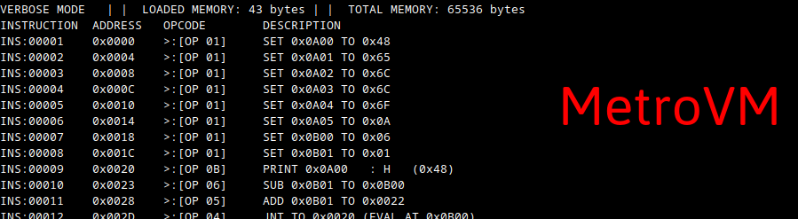

# MetroVM

_MetroVM is a virtual CPU that executes instructions inside a virtual RAM._

## USAGE
Compile all the `.c` files inside the `src/vmachine` directory using the compiler of your choice.  
Run the virtual machine using the following bash command:  
`./vmachine [VM EXECUTABLE FILEPATH]` 

In order to see a detailed log of all instructions performed at runtime, you can add the `-v` (verbose) flag to the end of the run command.

## PROGRAMMING
### Overview
The machine reads an executable file (`.vx` by default, but it can run any file extension).
The `.vx` file structure is a literal string of bytes, the machine reads byte by byte in order to execute instructions.

 
For example, if the file contains: 

`(hex) 01 0A 00 6A ...` it will be interpreted as "set the content of 0A00 to the value 6A".
After that, the machine will read the next instruction.
Therefore, it is possible to program directly in a hex editor, but for practical purposes, it is not recommended.

Included in the main folder is a Python script named _asmscript_ used to convert from a human readable assembly format to the executable format.

### Assembly Syntax
The assembler expects 1 command per line. For example:

`set 0A00 43` 
`print 0A00` 

is valid code, meanwhile:

`set 0A00 43 print 0A00`   will not be accepted.

Any character NOT part of the instruction will return an error. 
The assembler does NOT accept comments, these exceptions are handled by a preprocessor (not yet included).

The instruction set is detailed in the CPU INSTRUCTIONS section.

## MEMORY
MetroVM uses a 2-byte memory address, so it is limited to a max of 2^16 addresses, this results in a virtual RAM capacity of 65 536 bytes, you can optionally lower this inside the source and recompile.

 

## CPU INSTRUCTIONS
**This is the instruction table for the machine:**

_Note: all letters represent a 2-byte memory address. The only exception is NUM, which represents a 1-byte integer._

### STANDARD SET

| INSTRUCTION | OPCODE |HEX OPCODE|SIZE (BYTES) |DESCRIPTION | ASSEMBLER FORMAT 
| ------: | :------: | :-----: |:---:|:-------|:-------|
| **NOP** | 255 | 0xFF | 1 | No operation, skips | nop
| **STOP** | 0 | 0x00 | 1 | Stops the execution of the machine | stop
| **SET** | 1 | 0x01 | 4 | Sets content of A to a 1-byte integer | set A NUM
| **MOV** | 2 | 0x02 | 5 | Copies (moves) content of B into A | mov A B
| **JMP** | 3 | 0x03 | 3 | Sets (jumps) the instruction register to location L | jmp L
| **JNT** | 4 | 0x04 | 5 | Same as JMP but only if content of A is not 0 | jnt L A
| **ADD** | 5 | 0x05 | 5 | Adds content of B to content of A | add A B
| **SUB** | 6 | 0x06 | 5 | Subtracts the content of B to the content of A | sub A B
| **NOT** | 7 | 0x07 | 3 | Inverts all bits in memory cell A | not A
| **AND** | 8 | 0x08 | 5 | Performs bitwise AND between A and B, stores the result in A | and A B
| **OR** | 9 | 0x09 | 5 | Performs bitwise OR between A and B, stores the result in A | or A B
| **XOR** | 10 | 0x0A | 5 | Performs bitwise XOR between A and B, stores the result in A | xor A B
| **PRINT** | 11 | 0x0B | 3 | Prints content of A | print A
| **SCAN** | 12 | 0x0C | 3 | Recieves input from keyboard and stores it at A and the following bytes, depending on how many characters | scan A

***
### EXTENDED SET
#### Useful jump commands.

| INSTRUCTION | OPCODE |HEX OPCODE|SIZE (BYTES) |DESCRIPTION | ASSEMBLER FORMAT 
| ------: | :------: | :-----: |:---:|:-------|:-------|
| **JMZ** | 13 | 0x0D | 5 | Jumps if content of A is 0 | jmz L A
| **JEQ** | 14 | 0x0E | 7 | Jumps if content of A is equal to content of B| jeq L A B
| **JLT** | 15 | 0x0F | 7 | Jumps if content of A is less than content of B | jlt L A B
| **JGT** | 16 | 0x10 | 7 | Jumps if content of A is greater than content of B | jgt L A B
| **JLE** | 17 | 0x11 | 7 | Jumps if content of A is less than or equal to content of B | jle L A B
| **JGE** | 18 | 0x12 | 7 | Jumps if content of A is greater than or equal to the content of B | jge L A B 

#### Additional arithmetic operations.

| INSTRUCTION | OPCODE |HEX OPCODE|SIZE (BYTES) |DESCRIPTION | ASSEMBLER FORMAT 
| ------: | :------: | :-----: |:---:|:-------|:-------|
| **ADDC** | 19 | 0x13 | 6 | Adds two numbers of size S bytes. | addc S A B
| **SUBC** | 20 | 0x14 | 6 | Substracts two numbers of size S bytes. | addc S A B